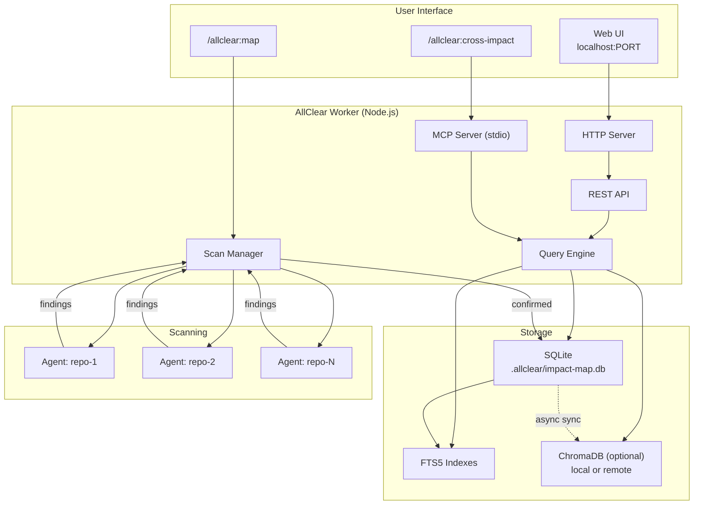
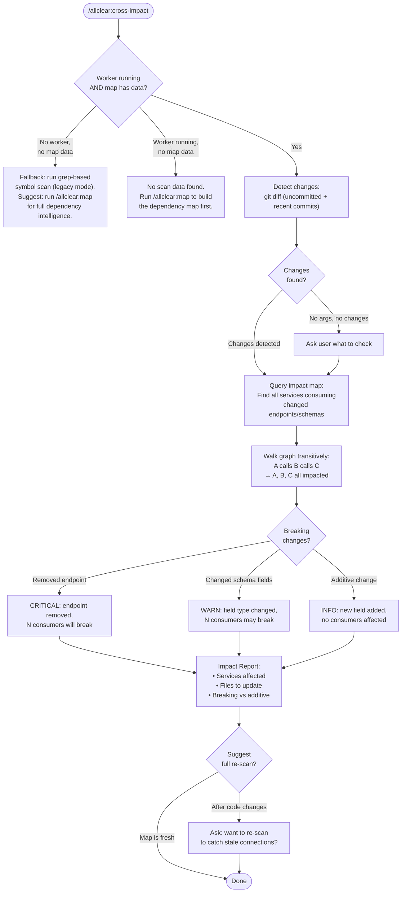
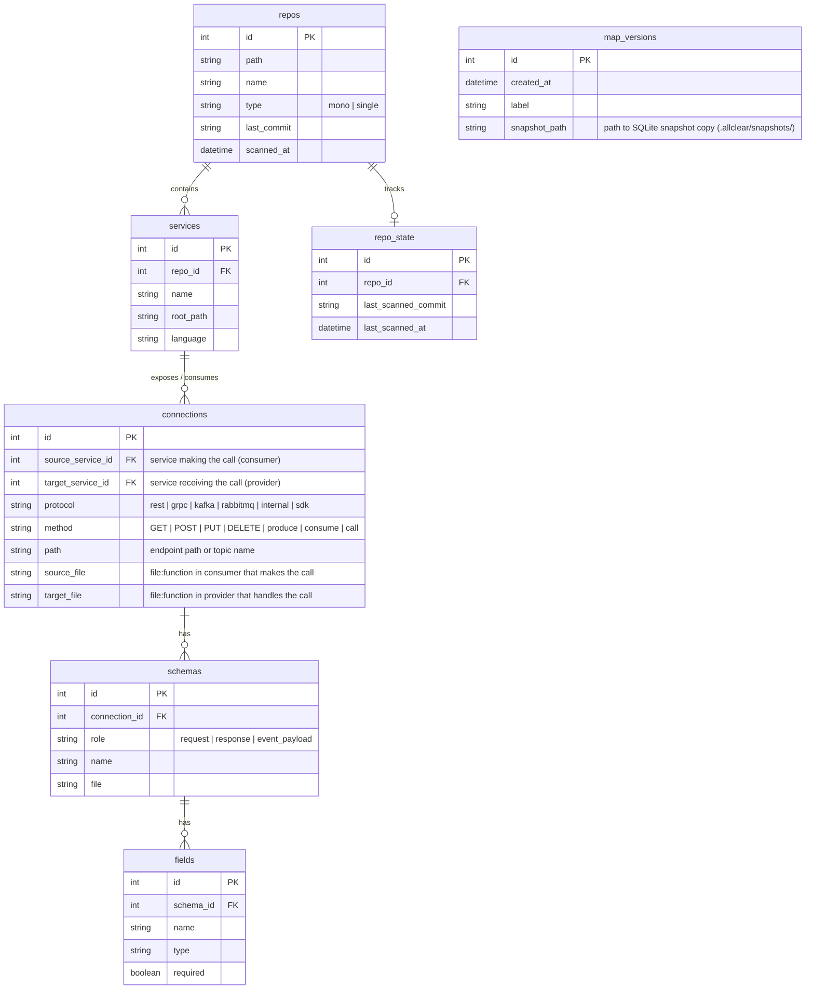
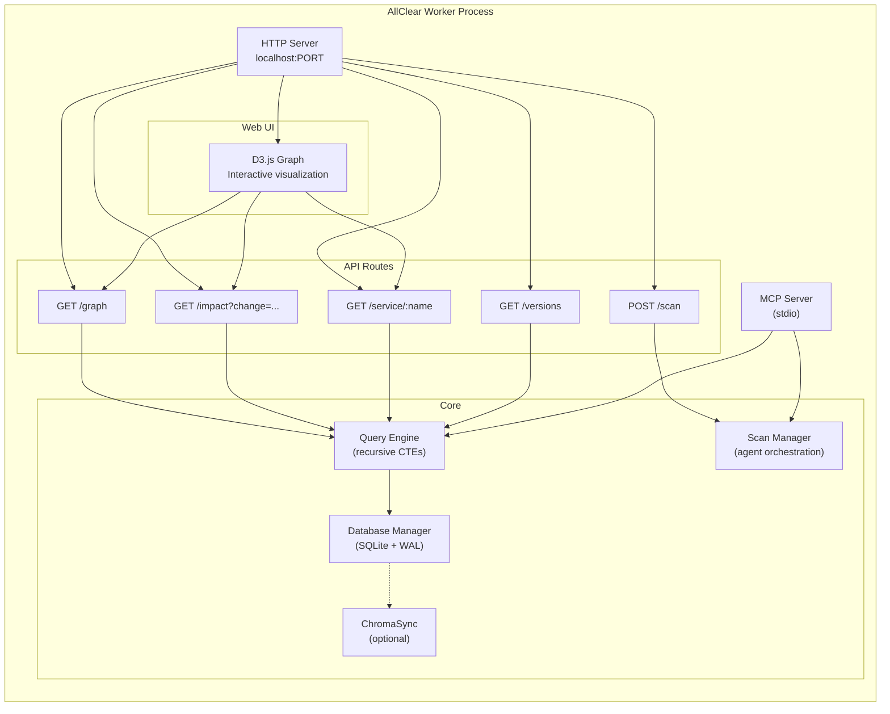
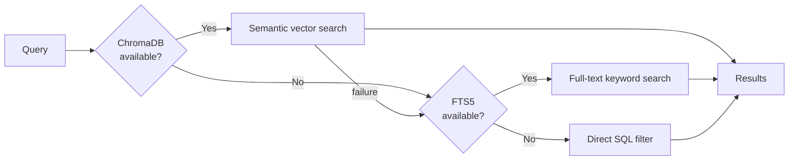

# Cross-Impact v2 — Service Dependency Intelligence

## Problem

Symbol-level grep across repos doesn't scale. With 6-7+ repos containing multiple services, users need API-level dependency intelligence — which services call which endpoints, with what schemas, and what breaks when something changes.

## Solution

A service dependency graph built by Claude agents, stored in SQLite (with optional ChromaDB vectors), queryable via MCP server, and visualized in an interactive localhost web UI.

---

## System Architecture



---

## Map Flow (`/allclear:map`)

```mermaid
flowchart TD
    START(["/allclear:map"]) --> VIEWCHECK{"--view" flag?}

    VIEWCHECK -->|Yes| MAPEXISTS{Map data<br/>exists?}
    MAPEXISTS -->|Yes| OPEN
    MAPEXISTS -->|No| NODATA["No map data yet.<br/>Run /allclear:map first<br/>to build the map."]

    VIEWCHECK -->|No| CHECK{allclear.config.json<br/>exists?}

    CHECK -->|Yes| LOAD["Load linked-repos from config"]
    CHECK -->|No| DISCOVER["Discover repos:<br/>1. Search memory<br/>2. Scan parent dir"]

    LOAD --> ENRICH["Check memory + parent dir<br/>for repos NOT yet in config"]
    DISCOVER --> COMBINE["Combine all sources,<br/>deduplicate"]
    ENRICH --> COMBINE

    COMBINE --> PRESENT["Present repo list to user<br/>(highlight newly discovered repos)"]
    PRESENT --> CONFIRM{User confirms<br/>repo list?}

    CONFIRM -->|Edit| EDIT["User adds/removes repos"]
    EDIT --> PRESENT
    CONFIRM -->|Confirm| SAVE["Save to allclear.config.json"]

    SAVE --> MODE{Scan mode?}
    MODE -->|"--full" flag| FULL["Full repo scan"]
    MODE -->|Default| FIRSTCHECK{First scan<br/>ever?}

    FIRSTCHECK -->|Yes| FULL
    FIRSTCHECK -->|No| INCREMENTAL["Scan changed files only<br/>(git diff since last scan)"]

    INCREMENTAL --> SPAWN
    FULL --> SPAWN
    VIEWONLY --> OPEN

    SPAWN["Spawn agents<br/>into each repo"]
    SPAWN --> SCAN["Agents extract:<br/>• Services<br/>• Endpoints exposed/consumed<br/>• Events produced/consumed<br/>• Internal calls<br/>• Schemas + fields"]

    SCAN --> RESULTS["Agents return findings<br/>with confidence levels"]

    RESULTS --> VALIDATE["Present ALL findings<br/>to user for confirmation"]

    VALIDATE --> HIGH["High confidence:<br/>Show summary, ask confirm"]
    VALIDATE --> LOW["Low confidence:<br/>Ask specific questions"]

    HIGH --> CONFIRMED{User confirms?}
    LOW --> CONFIRMED

    CONFIRMED -->|Edit| VALIDATE
    CONFIRMED -->|Confirm| EXISTING{Existing map<br/>data?}

    EXISTING -->|Yes| HISTORY{User wants to<br/>keep history?}
    EXISTING -->|No, first scan| PERSIST

    HISTORY -->|Yes| SNAPSHOT["Snapshot current map<br/>before overwriting"]
    HISTORY -->|No| PERSIST

    SNAPSHOT --> PERSIST["Write confirmed findings<br/>to SQLite"]

    PERSIST --> CHROMACHECK{ChromaDB<br/>available?}
    CHROMACHECK -->|Yes| SYNC["Sync vectors to ChromaDB"]
    CHROMACHECK -->|No| SKIP["Skip vector sync"]

    SYNC --> FIRST{First time<br/>map build?}
    SKIP --> FIRST

    FIRST -->|Yes| RECOMMEND["Recommend:<br/>1. Configure ChromaDB for semantic search<br/>2. Add AllClear MCP server to settings<br/>so all agents can check impact<br/>before making changes"]
    FIRST -->|No| OPEN

    RECOMMEND --> OPEN["Open graph UI in browser"]
```



---

## Cross-Impact Query Flow (`/allclear:cross-impact`)



---

## Data Model



---

## Worker Architecture



---

## Search Fallback Chain



---

## Configuration

Two config locations — project-level and machine-level:

### Project Config: `allclear.config.json` (project root)

Project-specific settings. Committed to git.

```json
{
  "linked-repos": ["../api", "../auth", "../sdk"],
  "impact-map": {
    "history": true
  }
}
```

### Machine Config: `~/.allclear/settings.json` (home directory)

Machine-specific settings. Never committed. Flat key-value pattern matching claude-mem's `~/.claude-mem/settings.json`.

```json
{
  "ALLCLEAR_WORKER_PORT": "37888",
  "ALLCLEAR_WORKER_HOST": "127.0.0.1",
  "ALLCLEAR_DATA_DIR": "/Users/you/.allclear",
  "ALLCLEAR_LOG_LEVEL": "INFO",
  "ALLCLEAR_CHROMA_MODE": "local",
  "ALLCLEAR_CHROMA_HOST": "localhost",
  "ALLCLEAR_CHROMA_PORT": "8000",
  "ALLCLEAR_CHROMA_SSL": "false",
  "ALLCLEAR_CHROMA_API_KEY": "",
  "ALLCLEAR_CHROMA_TENANT": "default_tenant",
  "ALLCLEAR_CHROMA_DATABASE": "default_database"
}
```

### Data Directory: `~/.allclear/` (home directory)

```
~/.allclear/
├── settings.json          (machine settings)
├── worker.pid             (daemon PID)
├── worker.port            (actual bound port)
├── logs/                  (worker logs)
└── projects/
    └── <project-hash>/
        ├── impact-map.db  (per-project graph DB)
        └── snapshots/     (version history)
```

**Config notes:**
- `linked-repos` alone does NOT start the worker. The `impact-map` section must be present for the worker to auto-start.
- `impact-map` section is created automatically after the first `/allclear:map` run.
- SQLite DB is per-project but stored centrally in `~/.allclear/projects/` — no `.allclear/` in the project repo, no gitignore needed.
- No `auto-start` flag — presence of `impact-map` section implies auto-start. Remove the section to disable.
- Worker startup triggered by `session-start.sh` (same pattern as claude-mem's SessionStart hook).

---

## MCP Server Tools

| Tool | Description | Parameters |
|------|-------------|------------|
| `impact_query` | Find consumers/producers of an endpoint or service | `service`, `endpoint`, `direction` (consumes/exposes), `transitive` (bool) |
| `impact_scan` | Trigger repo scan (incremental or full) | `repo` (optional, all if omitted), `full` (bool) |
| `impact_changed` | What's affected by current git diff | `repo`, `commit_range` (optional) |
| `impact_graph` | Get dependency subgraph for a service | `service`, `depth` (default 2), `direction` (upstream/downstream/both) |
| `impact_search` | Semantic search across the map | `query`, `limit` |

---

## Technology Stack (from research)

| Component | Choice | Version | Rationale |
|-----------|--------|---------|-----------|
| HTTP server | Fastify | v5.8.2 | 2.4x throughput over Express, built-in TypeScript, `@fastify/static` for UI serving |
| SQLite | better-sqlite3 | v12.8.0 | Synchronous API ideal for single worker, bundles SQLite 3.51.3 with WAL + FTS5 |
| MCP SDK | @modelcontextprotocol/sdk | v1.27.1 | `McpServer` + `StdioServerTransport`, shares SQLite connection with worker |
| Graph UI | D3.js | v7.9.0 | **Canvas renderer** (not SVG — performance cliff at 30+ nodes). Single `index.html` via ESM CDN import, zero build step |
| ChromaDB client | chromadb (npm) | v3.3.3 | Direct HTTP client to ChromaDB server. NOT chroma-mcp (Python-only) |
| Runtime | Node.js | v20+ | Required by both better-sqlite3 12.x and Fastify v5. v1.0 bash scripts unaffected |

### MCP Server Registration

MCP server is NOT shipped as `.mcp.json` in the plugin — it's a user-side configuration. After the first `/allclear:map` build, the command recommends adding this to the user's Claude Code settings:

```json
{
  "mcpServers": {
    "allclear-impact": {
      "type": "stdio",
      "command": "node",
      "args": ["<path-to-allclear-plugin>/worker/mcp-server.js"]
    }
  }
}
```

This ensures users opt in deliberately rather than having an MCP server auto-start on every session.

### Graph Query Safety

Recursive CTEs for transitive impact queries must include **cycle detection** — real service graphs have circular dependencies (A→B→C→A). Without cycle detection, queries infinite-loop.

```sql
WITH RECURSIVE impacted(id, depth, path) AS (
  SELECT target_service_id, 1, source_service_id || ',' || target_service_id
  FROM connections WHERE source_service_id = ?
  UNION ALL
  SELECT c.target_service_id, i.depth + 1, i.path || ',' || c.target_service_id
  FROM connections c JOIN impacted i ON c.source_service_id = i.id
  WHERE i.path NOT LIKE '%,' || c.target_service_id || ',%'  -- cycle detection
    AND i.depth < 10  -- depth limit
)
SELECT DISTINCT id FROM impacted;
```

---

## Versioning

Map snapshots stored in `~/.allclear/projects/<hash>/snapshots/`:
```
~/.allclear/projects/<hash>/
├── impact-map.db          (current map)
└── snapshots/
    ├── 2026-03-15T12:00:00.db
    └── 2026-03-20T09:30:00.db
```

The `map_versions` table in the current DB tracks metadata (timestamp, label) and paths to snapshot files. Snapshots enable "what changed in the dependency graph since last week" by diffing two SQLite files.

---

## Graceful Degradation

| State | `/allclear:cross-impact` behavior |
|-------|----------------------------------|
| No config, no worker, no map | Falls back to grep-based symbol scan (legacy). Suggests `/allclear:map`. |
| Config exists, worker running, no map data | Tells user to run `/allclear:map` first. |
| Config exists, worker running, map populated | Full dependency intelligence — graph queries, transitive impact, breaking change detection. |
| Worker running, ChromaDB unavailable | Works fully via SQLite + FTS5. No semantic search. |

---

## Suggested Build Order (from research)

Research identified dependency-driven ordering:

1. **Storage Foundation** — SQLite schema, migrations, query engine. Everything depends on this.
2. **Worker Lifecycle** — PID file, daemon spawn, health check, graceful shutdown. Can partially overlap with phase 1.
3. **MCP Server** — stdio MCP with impact tools. Can be parallel with phase 4.
4. **HTTP Server + Web UI** — Fastify, REST API, D3 Canvas graph. Can be parallel with phase 3.
5. **Scan Manager** — Agent orchestration, structured output parsing, confidence levels. Highest risk phase.
6. **User Confirmation Flow** — Batch high-confidence, drill into low-confidence. Integrated with scan manager.
7. **Command Layer** — `/allclear:map` and redesigned `/allclear:cross-impact`. Thin orchestration over worker.
8. **Integration** — Session hook worker auto-start, ChromaDB optional sync, E2E tests, graceful degradation.

---

## Key Design Principles

1. **User confirms everything** — No findings are persisted without user validation, regardless of confidence level.
2. **SQLite is the source of truth** — ChromaDB is optional acceleration. Everything works without it.
3. **Service, not repo** — The graph models services. Repos are just containers. Works for mono-repo, multi-repo, and hybrid.
4. **Agents, not tools** — Claude agents scan codebases and return structured findings. No external dependencies (tree-sitter, stack-graphs). Agents are pure code readers — they don't need MCP tools. The orchestrator writes findings to SQLite after user confirmation. MCP server is consumed by other agents (code-review, gsd-executor, etc.) when checking impact during code changes.
5. **Incremental by default** — Only scan what changed. Full re-scan available on demand.
6. **Protocol-aware** — Each connection knows its protocol (REST, gRPC, events, internal). Impact analysis considers protocol semantics.
7. **Field-level tracking** — Schema changes are tracked at the field level to distinguish breaking from additive changes.
